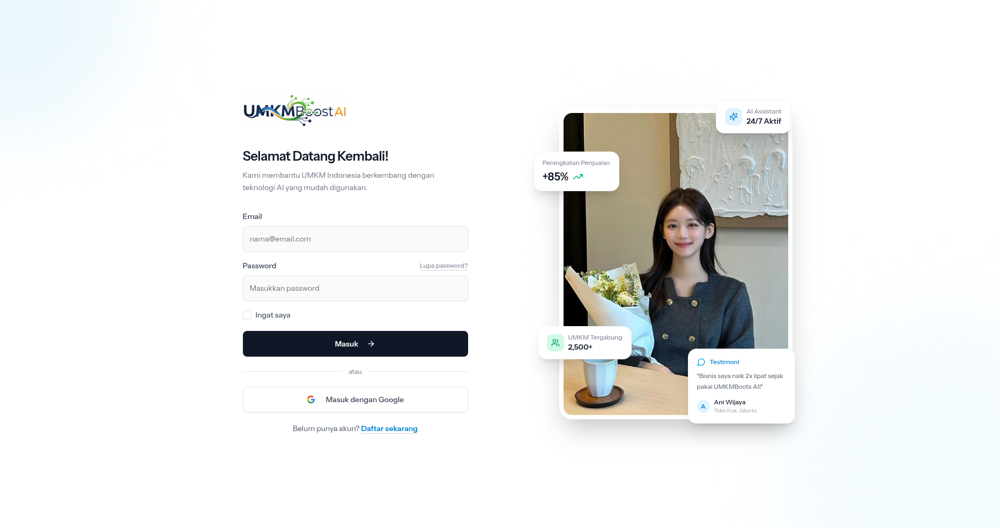
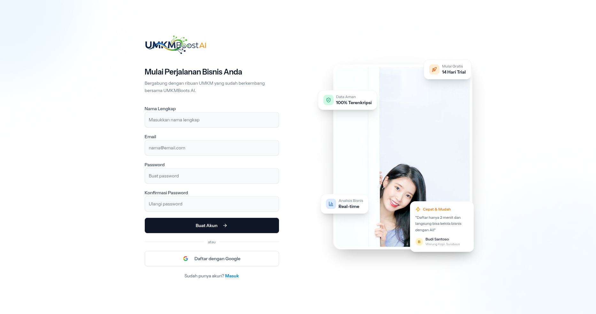
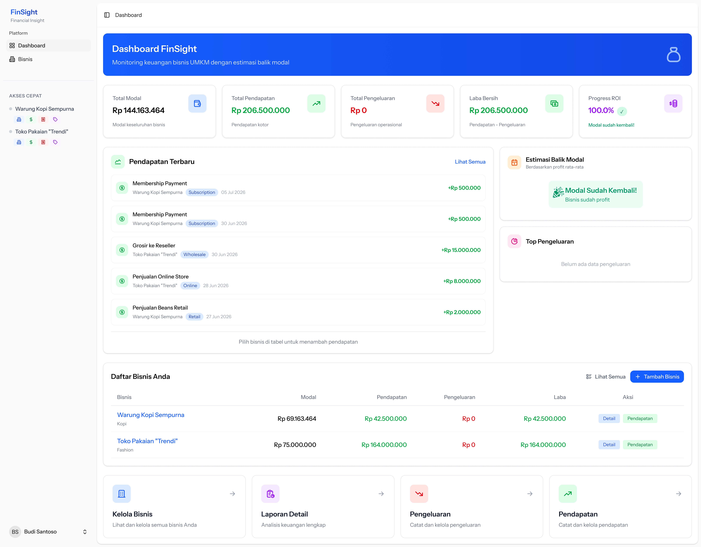
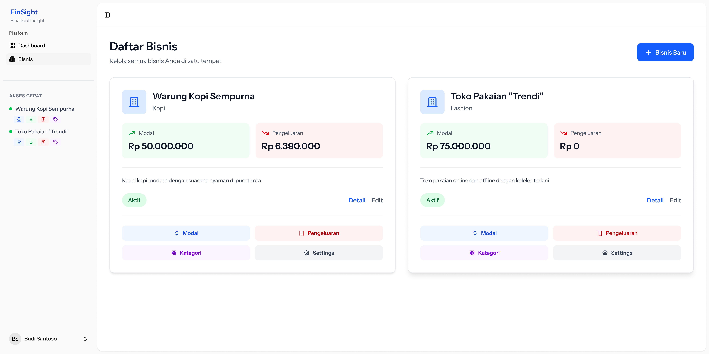
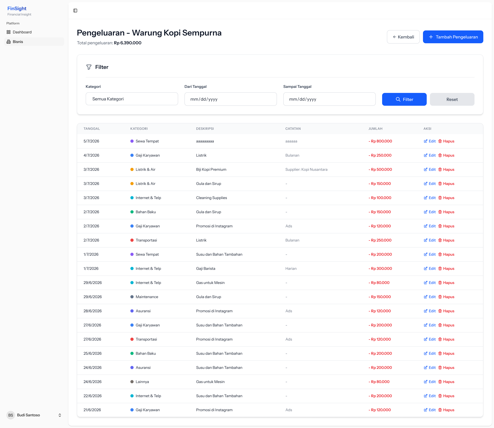
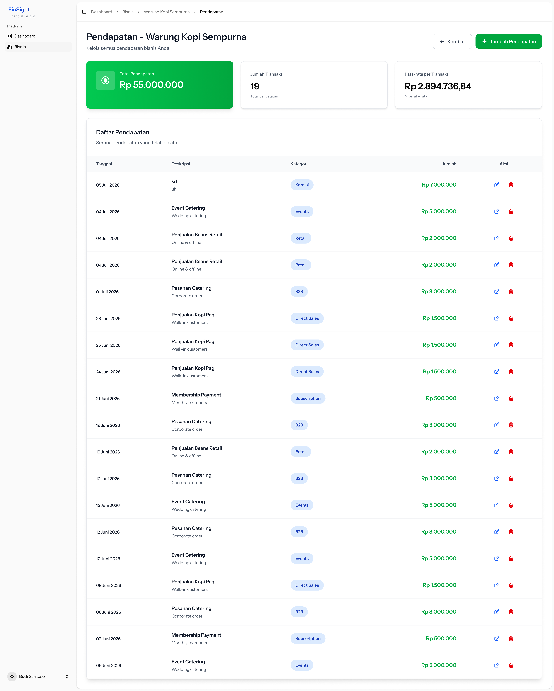

# FinSight — Smart Financial Insight Dashboard

FinSight adalah aplikasi web untuk membantu pelaku usaha kecil menghitung modal, keuntungan, dan estimasi waktu balik modal (Break-Even Point — BEP). Tersedia juga AI Assistant gratis (menggunakan model lokal / open‑source) untuk saran bisnis ringan, analisis sederhana, dan penjelasan laporan keuangan.

# FinSight — Smart Financial Insight Dashboard

FinSight adalah aplikasi web untuk membantu pelaku usaha kecil dan UMKM mengelola keuangan usaha: menghitung modal, memantau pengeluaran dan pemasukan, serta memperkirakan waktu balik modal (BEP). Aplikasi ini juga menyertakan AI Assistant ringan untuk rekomendasi dan analisis sederhana.

---

**Ringkasan Fitur**
- Input modal awal, biaya operasional (harian/mingguan/bulanan)
- Input harga jual & jumlah penjualan per periode
- Perhitungan otomatis: total pemasukan, total pengeluaran, keuntungan bersih, laba kotor
- Estimasi Break-Even Point (BEP) + visualisasi progres
- Manajemen kategori pengeluaran, modal tambahan, dan pendapatan
- Autentikasi pengguna (register / login) dan seed data demo

---

**Panduan Singkat (Setup & Menjalankan)**

1. Clone repository

```bash
git clone https://github.com/usernamenuh/UMKMBoost-AI.git
cd UMKMBoost-AI
```

2. Install dependensi PHP

```bash
composer install
```

3. Copy file environment dan atur pengaturan (database, mail, dsb.)

```bash
cp .env.example .env
# lalu edit .env sesuai lingkungan Anda (DB_CONNECTION, DB_DATABASE, DB_USERNAME, DB_PASSWORD, dsb.)
```

4. Generate application key

```bash
php artisan key:generate
```

5. Jalankan migrasi dan seed database

```bash
php artisan migrate --seed
```

6. Install dependensi frontend dan jalankan dev server (Vite)

```bash
npm install
npm run dev
# atau menggunakan pnpm/yarn sesuai preferensi
```

7. Jalankan aplikasi (contoh built-in server)

```bash
php artisan serve --host=127.0.0.1 --port=8000
# lalu buka http://127.0.0.1:8000
```

Catatan: jika menggunakan Docker / Sail, jalankan sesuai lingkungan Anda (mis. `./vendor/bin/sail up`).

---

**Akun Demo (seeded)**
Seeders sudah menambahkan beberapa akun demo. Gunakan kredensial berikut untuk masuk di environment development:

- demo1@finsight.id / password123  — Budi Santoso
- demo2@finsight.id / password123  — Siti Nurhaliza
- demo3@finsight.id / password123  — Ahmad Wijaya
- test@example.com / password     — Test User

Semua akun demo sudah di-mark verified oleh seeder (`email_verified_at` diisi), sehingga tidak perlu verifikasi email untuk login.

---

**Screenshots & Penjelasan**

Semua screenshot berada di folder `docs/image/`. Berikut daftar screenshot beserta penjelasan singkat untuk tiap tampilan:

- 
   - Halaman landing/beranda aplikasi. Menampilkan ringkasan fitur dan tombol untuk masuk/register.

- 
   - Form login pengguna. Gunakan akun seeded yang tercantum di atas pada environment development.

- 
   - Form pendaftaran pengguna baru (email/password). Setelah register, user dapat langsung login jika email verification dinonaktifkan atau diisi oleh admin.

- 
   - Dashboard utama menampilkan ringkasan keuangan: total pemasukan, total pengeluaran, keuntungan, dan progres BEP.

- 
   - Halaman manajemen bisnis/entitas usaha. Tambah, edit, atau pilih bisnis untuk melihat laporan rinci.

- 
   - Halaman pencatatan pengeluaran per kategori. Menampilkan daftar, filter, dan tombol tambah pengeluaran.

- 
   - Halaman daftar pendapatan / revenue. Memungkinkan pencatatan penjualan dan analisis per periode.

Tambahkan atau ganti screenshot di `docs/image/` untuk memperbarui dokumentasi visual.

---

**Database & Seeders**

- Seeders berada di `database/seeders/`. Seed utama `DatabaseSeeder` memanggil seeders yang relevan: `UserSeeder`, `BusinessSeeder`, `ExpenseCategorySeeder`, `CapitalSeeder`, `ExpenseSeeder`, `RevenueSeeder`.
- Untuk menjalankan seeders tunggal:

```bash
php artisan db:seed --class=UserSeeder
```

Jika Anda ingin mengosongkan dan isi ulang database (development):

```bash
php artisan migrate:fresh --seed
```


